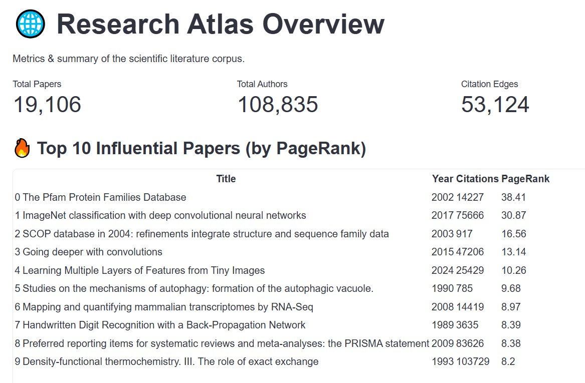
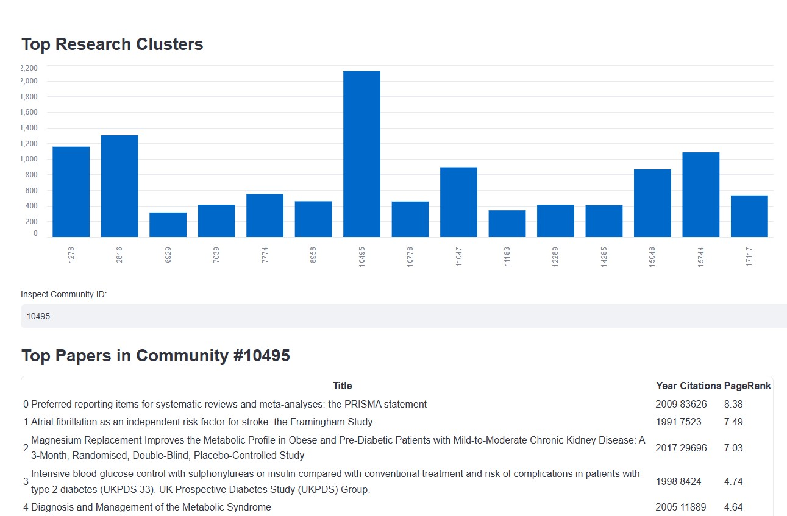
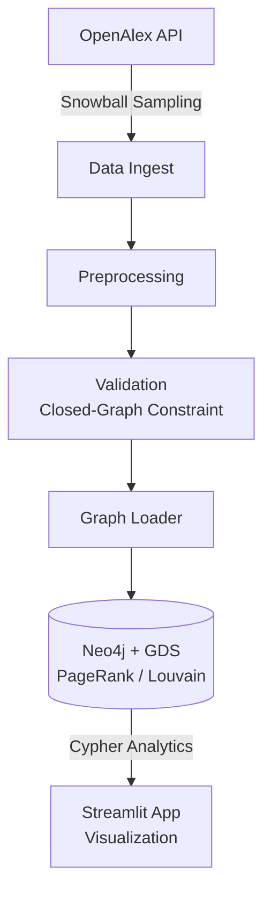
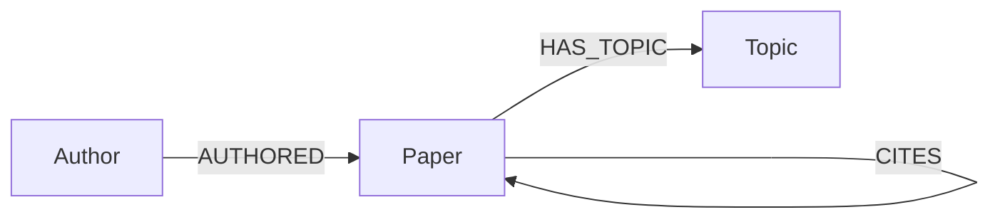

# Research Atlas: Knowledge Graph for Scientific Literature Exploration


**Research Atlas** is a domain-agnostic, graph-based analytical engine designed to discover structural relationships, citation lineages, and emergent research communities within scientific literature.

Rather than relying purely on traditional keyword matching—which treats literature as isolated text documents—Research Atlas models bibliographic metadata into a directed property graph. By combining **Snowball Sampling ETL**, **Neo4j Graph Data Science (GDS)**, and interactive graph exploration, the system unveils foundational papers and structural influence that raw citation counts often miss.

---

## 📸 Dashboard Preview

**Overview** — corpus-level metrics (papers, authors, citation edges) and the top 10 most influential papers by PageRank.



**Paper Lineage Explorer** — search any paper and inspect its citation context: what it cites, what cites it, and its ego-graph network.


**Research Clusters** — Louvain community detection over the citation graph, with drill-down into each cluster's top papers.



---

## 🏛️ System Architecture



---

## 📊 Knowledge Graph Schema

The core network is built around 3 primary node types and 3 directed relationship edges:



- **`Paper`**: `{id, title, year, publication_date, doi, cited_by_count, pagerank, community_id}`
- **`Author`**: `{id, name}`
- **`Topic`**: `{id, name}`

---

## ✨ Key Features

1. **Snowball Sampling Pipeline:** Ingests top-cited seed works and performs 1-hop reference expansion via OpenAlex API to guarantee high graph density.
2. **Closed-Graph Pruning:** Enforces graph integrity by stripping dangling citations that reference works outside the target corpus.
3. **Graph Data Science Engine:**
   - **PageRank Centrality:** Measures structural importance and prestige of works within the citation network topology.
   - **Louvain Community Detection:** Partitions literature into thematic clusters based purely on connectivity patterns.
4. **Interactive Dashboard:** Explores paper lineage, top research clusters, and structural network metrics built with Streamlit.

---

## 🛠️ Project Structure

```text
research-atlas/
├── data/
│   └── sample/               # 500-paper connected subgraph sample for quick demo
├── docs/
│   ├── assets/                # Dashboard screenshots used in this README
│   └── devlog/                # Electronic lab notebook documenting engineering decisions
├── src/
│   ├── ingestion/             # OpenAlex API client with polite-pool backoff
│   ├── preprocessing/         # Normalization and closed-graph validator
│   ├── graph/                 # Schema constraints & UNWIND batch graph loader
│   └── analysis/               # Neo4j GDS projections (PageRank & Louvain)
├── scripts/
│   └── create_sample.py       # Subgraph sample generator
├── dashboard/
│   └── app.py                 # Streamlit UI
├── docker-compose.yml         # Containerized Neo4j 5.x + GDS Plugin setup
├── requirements.txt
└── README.md
```

## 🚀 Quickstart Guide

### Prerequisites

- Python 3.10+
- Docker Desktop (for Neo4j container)

### 1. Clone & Setup Environment

```bash
git clone https://github.com/Gutzz99/research-atlas.git
cd research-atlas

# Create virtual environment
python -m venv venv
source venv/bin/activate  # On Windows: .\venv\Scripts\activate

# Install dependencies
pip install -r requirements.txt
```

### 2. Environment Variables Setup

Create a `.env` file in the root directory (this file is git-ignored — never commit real credentials):

```env
NEO4J_USER=neo4j
NEO4J_PASSWORD=your_own_password_here
NEO4J_URI=bolt://localhost:7687
USER_EMAIL=your.email@example.com
```

> `docker-compose.yml` should read these same values from `.env` rather than hardcoding defaults.

### 3. Spin Up Graph Database

```bash
docker compose up -d
```

*Access Neo4j Browser UI at `http://localhost:7474`.*

### 4. Run Pipeline & Dashboard

```bash
# Execute sample loading & analytics
python run_graph_loading.py
python run_analytics.py

# Launch Streamlit Application
streamlit run dashboard/app.py
```

*Access the app at `http://localhost:8501`.*

## 📓 Research Devlog & Reproducibility

We maintain an explicit decision log tracking hypotheses, trade-offs, and design choices. See `docs/devlog/` for technical deep dives into each iteration.

## 📄 License

Distributed under the MIT License. See `LICENSE` for details.
